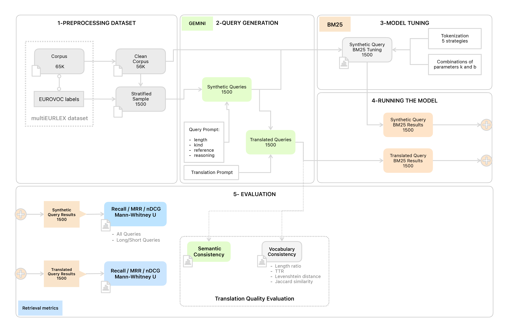

# BM25-on-Dutch

This repository contains the code and data for the master’s thesis:  
**"The Performance of BM25 in a Dutch Retrieval Setting (An Empirical Study on Parallel Legal Corpora Using Synthetic Queries)"**

Despite its age, BM25 remains a strong baseline in information retrieval. This thesis investigates its performance in Dutch, using synthetic queries on the parallel legal corpus [MultiEURLEX](https://huggingface.co/datasets/coastalcph/multi_eurlex). We find that BM25 performs comparably in Dutch and English when lexical alignment between queries and documents is preserved, but performance drops significantly when using machine-translated queries.

---

## Structure

The code is organized into Jupyter notebooks that read from and write to the `data/` folder.  
To reproduce the results from the thesis, do not run the final cell in each notebook (which saves the data), unless you explicitly intend to update the existing data.

### Notebooks

- **`1_preprocessing_MultiEURLEX_dataset.ipynb`**  
  Loads the English and Dutch MultiEURLEX data and removes outliers.

- **`2_parametrized_prompt_template.ipynb`**  
  Defines and generates a diverse set of prompt templates for query generation.

- **`3_the_generation_prompt.ipynb`**  
  Generates 1500 synthetic queries using the Google Gemini API.  
  Requires an API key to be stored in the `keys.py` file.

- **`4_BM25_application_evaluation.ipynb`**  
  Core evaluation notebook. Uses the [BM25S](https://github.com/xhluca/bm25s) library to index the corpus and retrieve documents.  
  Evaluates performance under various preprocessing strategies and data subsets using [rank-eval](https://pypi.org/project/rank-eval/), reporting metrics like Recall@K, MRR@K, and nDCG@K.  
  Includes statistical significance testing (Mann-Whitney U test).

- **`4b_BM25_grid_search.ipynb`**  
  Performs grid search to tune BM25 hyperparameters (`k`, `b`) for both Dutch and English.

- **`5_the_translation_part.ipynb`**  
  Translates synthetic queries using Gemini to assess the impact of machine translation on BM25 performance.

- **`6_assessing_translation_quality.ipynb`**  
  Evaluates translation quality using semantic equivalence and lexical overlap measures.

---

### Overview

